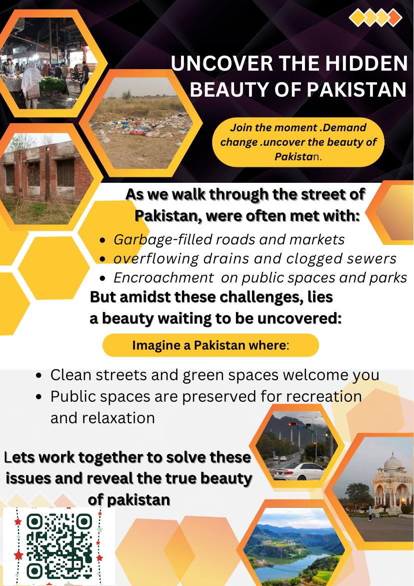
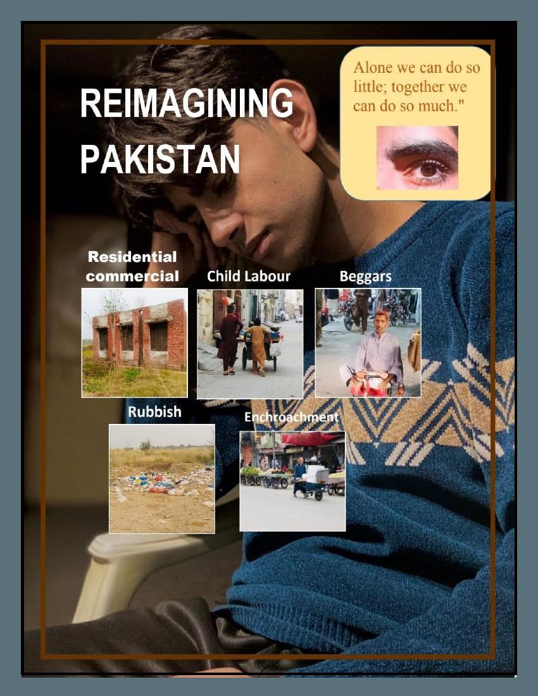
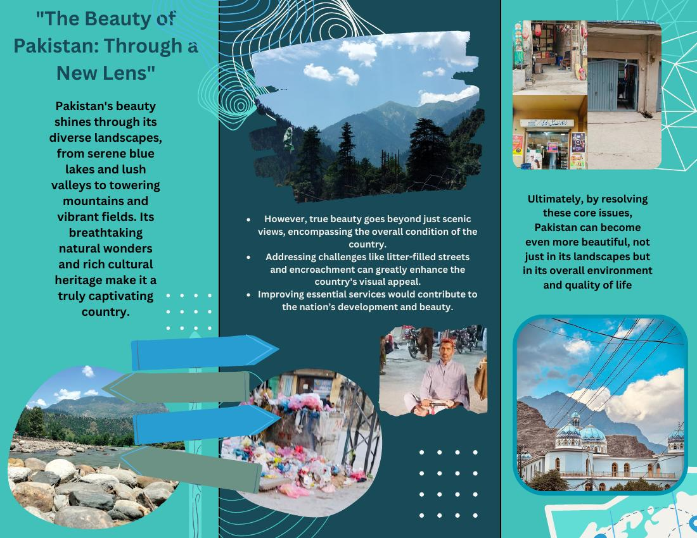

# Reimagining Pakistan — ICT Final Project (Semester 1)

## 📌 Overview

A social-awareness design campaign created for the ICT course, first semester. The project documents everyday urban issues in Pakistan — overflowing garbage, encroached public spaces, child labour, and informal begging — and reframes them as a call to action through a flyer, brochure, and magazine.

The goal wasn't just to point out problems, but to pair them with a vision of what public spaces could look like if these issues were addressed — clean streets, preserved green spaces, and community-driven change.

## 🖼 Preview

  
  
  

## 📄 Files Included

| File                  | Description                 |
|-----------------------|------------------------------|
| `MAGAZINE Final.pdf`  | Full 17-page magazine layout, documenting the issues and the "change makers" narrative |
| `Project Brochure.pdf`| Tri-fold brochure contrasting Pakistan's natural beauty with the urban issues covered |
| `Project Flyer.pdf`   | Single-page promotional flyer summarizing the campaign |

## 🎯 What This Project Involved

- **Field research & photography** — on-the-ground documentation of real streets, markets, and public spaces
- **Visual storytelling & layout design** — structuring a narrative across three different formats (flyer, brochure, magazine)
- **Message design** — translating a social problem into something people would actually stop and read
- **Deadline-driven teamwork** — delivered as a semester-end final project

## 🛠 Tools Used

- Microsoft Word
- Canva

## 🎓 Course

ICT — Riphah International University, Semester 1

## About Me

Software Engineering student — this project sits alongside my dev work as an example of research, design, and communication skills outside of code. Check my other repos for software projects.
